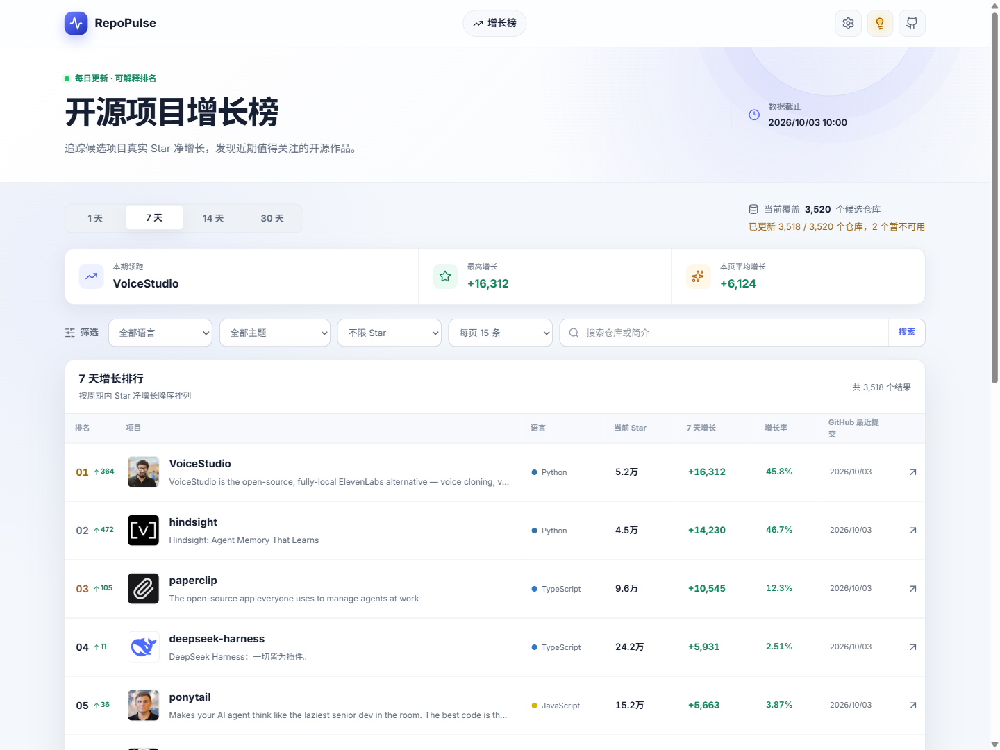
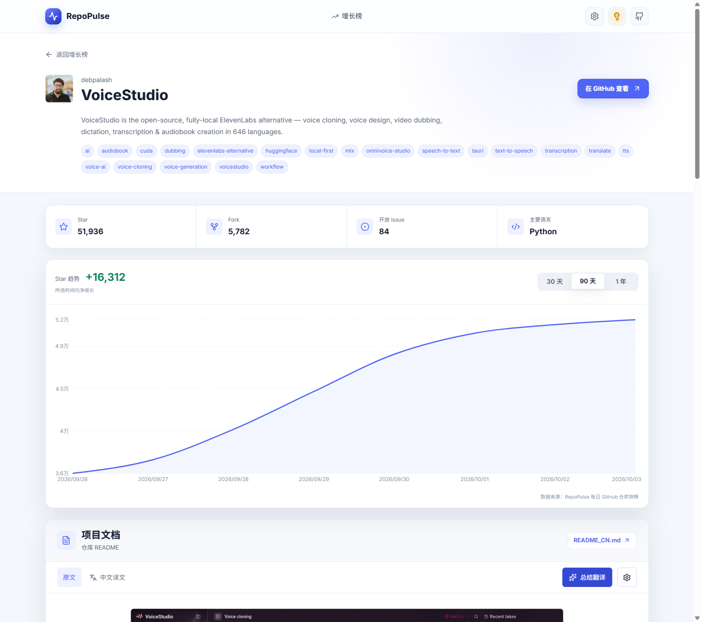
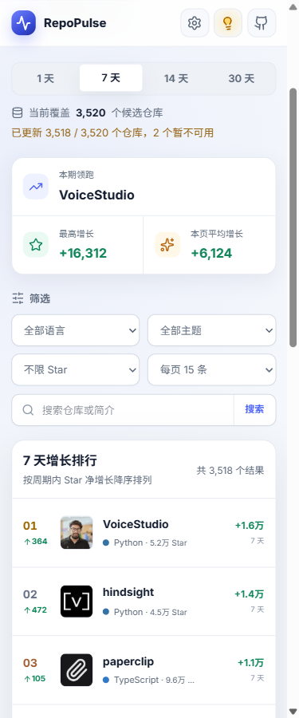

# RepoPulse

**简体中文** | [English](README.en.md)

[](https://github.com/SSlaks/RepoPulse/actions/workflows/ci.yml)
[](LICENSE)

RepoPulse 是一个中文 GitHub 开源项目增长榜。它每天按快照记录候选仓库的 Star 数，计算最近 1、7、14、30 天的净增长，并提供筛选、仓库详情与趋势图，帮助你用可解释的数据发现正在增长的项目。

**在线演示：<https://repopulse.slak7.cn>**（公开在线演示站点）

## 界面



<details>
<summary>更多截图（详情页与移动端）</summary>





</details>

> 截图取自公开演示站点，仅用于展示界面，不代表实时数据快照。

## 功能

- 每日 1 / 7 / 14 / 30 天 Star 净增长榜
- 榜单筛选、仓库详情与趋势图
- 自带 API Key 的 AI「总结翻译」与全文「中文译文」
- 冷缺 README 后台预热，正文持久化于 PostgreSQL

## 快速开始

前置条件：[Docker](https://docs.docker.com/get-docker/) 与 Compose v2（用 `docker compose version` 确认）。命令从仓库根目录执行。`.env` 只需在全新克隆后复制一次；如果它已存在，请勿覆盖，直接复用现有配置。

**Bash**

```bash
cp .env.example .env
docker compose up -d --build postgres redis api frontend
```

**PowerShell**

```powershell
Copy-Item .env.example .env
docker compose up -d --build postgres redis api frontend
```

这是最快的静态演示路径：只启动数据库、缓存、API 与前端，`api` 会等待一次性 `migrate` 服务成功后再启动。`migrate` 只执行 Alembic 迁移，演示数据由 API 在启动时写入。浏览榜单、详情与趋势图不需要 `worker` 和 `beat`；只有需要抓取实时 GitHub 数据或预热 README 时，再运行 `docker compose up -d worker beat`。

打开站点 <http://localhost:3000>，API 文档见 <http://localhost:8000/docs>。

## 纯源码开发

不用 Docker 时需要 Python 3.12 及以上与 Node.js 22。请开两个终端，各自从仓库根目录开始，`uvicorn` 会持续占用终端 1。

**终端 1：后端 API**

```powershell
cd backend
python -m venv .venv
.\.venv\Scripts\Activate.ps1
pip install -e ".[dev]"
uvicorn app.main:app --reload --port 8000
```

**终端 2：前端**

```powershell
cd frontend
npm ci
npm run dev
```

后端默认使用 SQLite 并在启动时写入演示数据。完整步骤见[开发快速上手](docs/getting-started.md)。

## 技术栈

Next.js / React / TypeScript · FastAPI / Pydantic / SQLAlchemy / Alembic · Celery / Redis / PostgreSQL · Pytest / Playwright / Ruff / Mypy

## 排名口径

- 每日按快照记录候选仓库的 Star 数，计算最近 1、7、14、30 天的净增长：`net_delta = end_stars - start_stars`，`growth_rate = net_delta / start_stars`。
- 目标日与基线快照按 UTC 日历日计算，基线取 `as_of - period`。
- 榜单只覆盖 RepoPulse 当前跟踪的候选仓库，不代表全 GitHub 排名，也不复刻 GitHub Trending 的算法。
- 已发布的历史榜单不回溯重算，后续数据更新不会改写既有排名。

## 测试与贡献

后端校验、前端 lint / typecheck / build 与 Playwright 端到端测试的完整前置条件和命令见 [CONTRIBUTING.md](CONTRIBUTING.md)。端到端测试当前包含 `desktop-chromium` 与 `mobile-chromium` 两个项目，需要先构建前端并准备好后端与 Redis：

```powershell
cd frontend
npm test -- --project=desktop-chromium
```

## 文档

- [开发快速上手](docs/getting-started.md)
- [生产部署与运维（维护者手册）](docs/operations.md)
- [访问限流与租约](docs/rate-limits.md)
- [参与贡献](CONTRIBUTING.md)
- [安全策略](SECURITY.md)
- [问题反馈](https://github.com/SSlaks/RepoPulse/issues)
- [发布记录](https://github.com/SSlaks/RepoPulse/releases)

## 提交安全

`.env` 与 `.env.production` 可能包含 GitHub Token、数据库连接等密钥，已被 `.gitignore` 忽略，禁止提交。模板见 `.env.example` 与 `.env.production.example`。若怀疑密钥泄漏，请按 [SECURITY.md](SECURITY.md) 私下报告。

## 许可证

[MIT](LICENSE)
