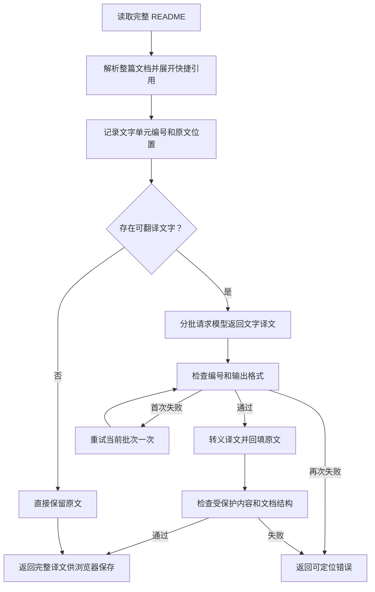

# README 中文译文修复方案

日期：2026-10-06。本文是待实施的修复设计，不代表代码已修改或生产已发布。

## 目标与依据

修复 tester-army/e2e 的纯 HTML 横幅进入翻译流程的问题，并减少混合正文中代码、链接或 HTML 被模型改写引起的失败。

已确认：生产版本的 splitMarkdown 只按最外层节点类型判断是否原样保留。该 README 的首段最外层是 paragraph，内部三个子节点全部是 html，因此被送给模型。只改变其中的 alt 描述即可复现现有校验错误。生产日志中七次 357 字节响应与第一段校验失败的响应大小一致，但没有保存真实输出，不能据此确定当次具体改动的字段。

本版采用“保留原文骨架、按编号翻译文字”的方式。程序从文档中提取可翻译文字，模型返回编号与译文的对应关系；程序将译文回填原文。代码、URL、HTML 和 Markdown 结构不采用模型输出。

## 内容处理规则

| 内容 | 处理规则 |
| --- | --- |
| 标题、段落、列表项、表格单元格、引用中的普通文字 | 提取为文字单元，交给模型翻译 |
| 加粗、斜体、删除线中的文字 | 翻译内部文字，保留原始格式分隔符 |
| 行内代码与代码块，包括列表或引用中嵌套的代码 | 保留原文，不创建文字单元 |
| 普通链接 | 翻译显示文字；保留目标地址、可选 title 和链接语法 |
| 完整引用链接，如 `[Docs][docs]` | 翻译显示文字；保留引用标识和定义 |
| 快捷、折叠引用，如 `[Docs]`、`[Docs][]` | 程序先展开为显式引用，再翻译显示文字，避免译文标签改变引用标识 |
| 自动链接、裸 URL、邮箱地址 | 保留原文，避免把地址误当作显示文字翻译 |
| Markdown 图片 | 首版完整保留图片语法、地址、alt、title |
| HTML 块 | 完整保留，包括块内文字，沿用当前 HTML 保留约定 |
| 段落中的 HTML 标签 | 标签及属性原样保留；标签外的普通文字可翻译 |
| 全部由 HTML 或空白组成的段落 | 原样保留，不调用模型 |
| 链接定义、分隔线、列表标记、表格分隔符、段落间空行 | 原样保留 |

引用链接必须基于整篇 README 解析，不能单独解析每个批次，否则位于后续段落的引用定义可能无法识别。引用展开只改变引用写法，不改变目标地址和标识；不重新序列化整篇文档。

## 程序处理流程



### 1. 构建翻译计划

- 整篇解析 Markdown，使用现有 unified、remark-parse、remark-gfm，不新增解析依赖。
- 识别并展开已经解析成功的快捷、折叠引用，再建立文字位置索引。未解析的方括号文字按普通正文处理。
- 文字单元包含 `id`、所属块、文字原值、起止位置和渲染上下文；只有含非空白文字的单元进入请求。
- 使用解析树和源码位置定位文字，不用全局正则识别链接或 HTML。
- 代码、HTML、定义、图片和自动链接的范围不可作为文字回填范围；源范围必须完整、互不重叠。
- 没有文字单元的块直接保留。该 README 的首段横幅因此自然跳过模型。

### 2. 分批翻译

沿用顺序执行、README 100,000 字符上限和单块 16,000 字符上限。以当前 6,000 字符合并规则为基础，对文字单元分批，并将上下文及 JSON 开销纳入输入预算。列表或表格中的文字可以分批，其原文结构始终留在程序中。

程序先决定哪些内容需要翻译，再按块提供去除受保护原值的上下文，帮助模型理解句子中被代码或链接分开的文字。真实代码、HTML、链接和图片地址保留在服务器内存中，不随翻译请求发送给模型；上下文用“代码位置”“链接起止”等标记表示这些位置。上下文标记只是参考，不要求模型返回，也不参与译文回填。模型只返回已提取的文字单元，不负责筛选内容。模型仍遵守现有“不执行 README 内指令”的系统约定。

请求示例：

```json
{
  "blocks": [
    {
      "id": "b0001",
      "context": "Run ⟦CODE_1⟧ and read ⟦LINK_1_START⟧the documentation⟦LINK_1_END⟧.",
      "texts": [
        {"id": "t0001", "text": "Run "},
        {"id": "t0002", "text": " and read "},
        {"id": "t0003", "text": "the documentation"},
        {"id": "t0004", "text": "."}
      ]
    }
  ]
}
```

模型返回：

```json
{
  "translations": [
    {"id": "t0001", "text": "运行"},
    {"id": "t0002", "text": "并阅读"},
    {"id": "t0003", "text": "文档"},
    {"id": "t0004", "text": "。"}
  ]
}
```

对返回值采用严格 schema：编号必须恰好覆盖当前批次，重复、缺失、未知编号均报错；允许数组顺序不同。译文必须是有界、非空的纯文本。不得将模型返回值当作整段 Markdown。

### 3. 回填与校验

- 在原文中按位置从后向前替换文字范围，保留其余字节；保护原有首尾空白。
- 将返回文字按普通 Markdown 文本转义，防止其中的反引号、方括号、HTML、竖线等生成新的结构。
- 表格单元格中的竖线转义，模型新增的换行按正文上下文规范化，不允许新增表格行或段落。段落间空行不在可替换范围内。
- 保留原始代码、URL、HTML、图片和引用定义。最终使用原始 README 与输出比对受保护元素；快捷引用展开允许 referenceType 改变，但 identifier 和目标必须一致。
- 对比规范化后的结构签名：忽略文字内容和位置，保留节点层级、标题层级、列表属性、表格列对齐及链接身份，防止新增、删除或改变结构。
- 若受保护内容或结构不一致，立即失败并记录诊断；这种错误不触发模型重试，因为结构由程序持有，需要检查回填实现。

### 4. 重试、取消与进度

- 只对当前批次的本地输出解析失败、编号缺失或重复等错误重试一次。
- 不对密钥错误、额度不足、限流、网络失败、取消和超时进行自动重试。
- 每次重试前检查原任务 AbortSignal；沿用单次调用 90 秒、整项任务 10 分钟超时和现有限流租约。
- 重试属于同一任务、同一租约，不重新申请任务，也不重置总超时。
- 正常进度按已验证的批次推进，重试时展示“正在重试第 X / Y 批”，不重复增加完成数。
- 任何失败都不返回部分译文，不覆盖已有浏览器记录。只有完整译文校验通过后才允许保存。

## 修改文件与职责

| 文件 | 改动 |
| --- | --- |
| `frontend/src/lib/ai/server/markdown-translation.ts`（新增） | 解析、引用展开、文字范围提取、批次计划、回填、结构与受保护内容校验。纯计算模块，不调用模型 |
| `frontend/src/lib/ai/server/translate.ts` | 调整翻译提示词和内部返回 schema；编排批次、有限重试、进度和诊断。摘要继续沿用现有逻辑。已有导出可通过重导出保持测试兼容 |
| `frontend/tests/ai-server.spec.ts` | 扩展服务端回归测试，更新翻译 mock 为编号映射；摘要测试不改为新协议 |
| `frontend/tests/fixtures/tester-army-e2e-readme.md`（新增） | 固定本次排查取得的生产 README，记录来源和获取日期，不依赖测试时的 GitHub 内容 |
| `frontend/tests/ai-ui.spec.ts` | 复用现有失败保留旧译文场景，验证诊断提示、重试进度和取消行为 |

公共接口仍接收现有凭据、Markdown 和 mode，成功仍返回 `{mode:"translation",translation:"..."}`。浏览器记录格式、原文指纹算法和 Markdown 展示组件可继续使用。

建议纯计算模块提供 `prepareMarkdownTranslation`、`parseTextTranslations`、`applyTextTranslations`、`validateMarkdownTranslation` 等职责明确的函数。不要在模型请求适配层混入 Markdown 处理。

## 诊断规则

在翻译任务内部生成诊断编号，输出结构化错误日志，包含：事件名、诊断编号、原文 SHA-256、厂商、模型、批次、尝试次数、处理阶段、异常类别，以及编号缺失或结构差异的定位信息。

不记录凭据对象、API Key、内部 token、完整 README 或完整模型响应。受保护元素变化只记录类型、序号、长度和摘要值。首次输出异常与最终失败可以记录，正常批次不逐条打印日志。

用户提示示例：`第 2 批译文缺少文字单元，重试后仍未通过校验。已保留原文。诊断编号：…`。继续使用现有 error 事件和 INVALID_OUTPUT 错误码。

## 验收用例

| 场景 | 必须满足 |
| --- | --- |
| tester-army/e2e 固定样例 | 横幅、徽章、Star History HTML 和两段代码原样保留；普通正文、表格说明和链接显示文字可以翻译；纯 HTML 块不创建模型任务 |
| `<a></a>` 纯 HTML 段落 | 模型调用次数为零，输出与输入一致 |
| `Hello <span class="x">world</span>` | 标签和属性不变，标签外文字可翻译 |
| 列表或引用中的嵌套代码 | 代码及其所在结构保持正确 |
| 行内代码与链接交错的句子 | 译文可读，代码和地址准确保留 |
| 请求包含受保护元素的上下文 | 实际命令、HTML、URL 和图片地址不进入请求，只出现位置标记和待翻译文字 |
| 表格译文含竖线、反引号或换行 | 不新增列、行、代码节点或段落 |
| 完整、快捷、折叠引用及跨块定义 | 译文标签仍指向原定义；原标识和地址一致 |
| 自动链接、邮箱、图片 alt/title | 首版保持原值 |
| 返回编号顺序变化 | 正确按编号回填，不误配译文 |
| 缺失、重复、未知编号或无效 JSON | 只重试当前批次一次；持续失败不产生成功结果 |
| 上游认证、限流、取消、超时 | 不重试；及时退出并释放租约 |
| 重试过程中取消 | 立即终止，不发起后续批次，不保存部分记录 |
| 输出含 Markdown/HTML 语法 | 作为文字转义，不增加链接、代码或 HTML |
| 摘要功能和已有浏览器译文记录 | 原有功能正常，失败不覆盖已有记录 |
| 日志中存在测试密钥或文档敏感内容 | 视为测试失败 |

静态检查运行 `npm run typecheck`、`npm run lint`、`npm run build`。服务端测试复用 Playwright 的 ai-server.spec.ts；界面测试使用项目既有构建与测试服务配置。所有实际命令、结果和无法验证项在实施完成后记录，本文不将计划中的检查描述为已经通过。

## 实施与发布

1. 固定本次 README 样例，先补能复现纯 HTML 分段缺陷的测试。
2. 实现解析与文字回填模块，用纯计算测试验证结构边界。
3. 接入翻译批次协议、有限重试和诊断，运行服务端与浏览器回归检查。
4. 使用用户现有 DeepSeek 配置对该 README 进行真实验收，核对译文流畅性、链接、代码、表格和 HTML 保留情况；不在文档或日志中保存密钥。
5. 在明确执行生产发布时，按 scripts/repopulse_ops.py 和现有运维规范发布经过验证的版本。记录发布前镜像与提交，发布后核验站点和翻译流程；失败按原流程回滚。

这次会改变完整翻译的内部模型输出协议，需要重点回归混合行内元素的译文流畅性、快捷引用、表格转义和取消重试。短文字单元可能降低语句自然程度，通过块上下文和真实模型验收检查；程序保护只能保证结构和受保护内容，不能保证模型翻译语义完全正确。
